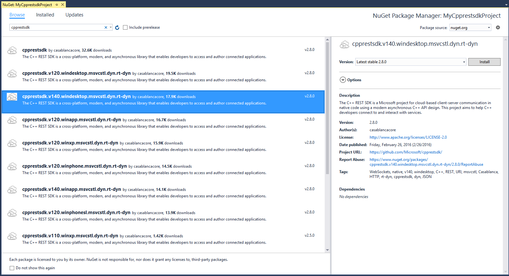

# Http Client Tutorial

This tutorial walks through how to setup up a simple Windows desktop application utilizing Casablanca. In particular taking a look at how to use our http_client to connect to a server and download some data. Aside from the initial setup referencing the NuGet package and Visual Studio specific photos, everything is NOT Windows specific. All the code and features described here work on any of our supported platforms.  

### Getting the C++ Rest SDK NuGet Package

The C++ Rest SDK NuGet package allows you to easily add Casablanca to an application without having to manually deal with setting up includes, libs, dlls, and deployment with Windows store applications. Make sure you have the Visual Studio [NuGet Package Manager installed](How-to-use-the-C---Rest-SDK-NuGet-package), then find the C++ Rest SDK NuGet package by right clicking on your project and selecting "Manage NuGet Packages...". From the dialog search for "Casablanca":  



More detailed instructions for setting up our NuGet package can be located [here](How-to-use-the-C---Rest-SDK-NuGet-package). If you are developing for Linux, Mac, or iOS take a look at our instructions under [documentation](Home) on how to build Casablanca.

### Setting up Includes and Namespaces

Now that Casablanca is downloaded and added to the project the next step is to include the header files we need. For this example we are going to use the http_client and one of Casablanca's asynchronous streams for files. To do so add the following includes:  

```c++
#include <cpprest/http_client.h>
#include <cpprest/filestream.h>
```

Here is a list of other important header files in Casablanca, but these we won't be using them in this example:  

```c++
#include <cpprest/http_listener.h>              // HTTP server
#include <cpprest/json.h>                       // JSON library
#include <cpprest/uri.h>                        // URI library
#include <cpprest/ws_client.h>                  // WebSocket client
#include <cpprest/containerstream.h>            // Async streams backed by STL containers
#include <cpprest/interopstream.h>              // Bridges for integrating Async streams with STL and WinRT streams
#include <cpprest/rawptrstream.h>               // Async streams backed by raw pointer to memory
#include <cpprest/producerconsumerstream.h>     // Async streams for producer consumer scenarios
```


To save explicitly typing common namespaces over and over add the following using statements:  

```c++
using namespace utility;                    // Common utilities like string conversions
using namespace web;                        // Common features like URIs.
using namespace web::http;                  // Common HTTP functionality
using namespace web::http::client;          // HTTP client features
using namespace concurrency::streams;       // Asynchronous streams
```

Other important namespaces not used in this tutorial in Casablanca include:  

```c++
using namespace web::http::experimental::listener;          // HTTP server
using namespace web::experimental::web_sockets::client;     // WebSockets client
using namespace web::json;                                  // JSON library
```


### Making an Http Request and Saving the Results

In this tutorial we are going to asynchronously make a request to [http://www.bing.com](http://www.bing.com) and save the results to a file. I'm creating a Windows console applications so all the code will be written inside the main() function, but it could be located in any function. First start by opening a stream to the file for us to save the response body in:  

```c++
    auto fileStream = std::make_shared<ostream>();

    // Open stream to output file.
    pplx::task<void> requestTask = fstream::open_ostream(U("results.html")).then([=](ostream outFile)
    {
        *fileStream = outFile;
    })
```


Here we are opening a raw byte stream to a file called results.html. Since this is a potentially blocking I/O operation it is being done asynchronously - you will see this pattern used in Casablanca consistently. Read more about task-based asynchronous programming [here](Programming-with-Tasks)  

Next create an http_client and make the actual HTTP request. Update the lambda to the following:  

```c++
    // Open stream to output file.
    pplx::task<void> requestTask = fstream::open_ostream(U("results.html")).then([=](ostream outFile)
    {
        *fileStream = outFile;

        // Create http_client to send the request.
        http_client client(U("http://www.bing.com/"));

        // Build request URI and start the request.
        uri_builder builder(U("/search"));
        builder.append_query(U("q"), U("cpprestsdk github"));
        return client.request(methods::GET, builder.to_string());
    })
```


The code here is constructing an instance of Casablanca's http_client for bing.com and then formulating the request query before sending the request. If you need to specify any special options like timeouts, proxies, or credentials this can be done at construction using the http_client_config class. There also exist a variety of http_client::request overloads for sending a request body. Now the lambda function will return a task of the http_response.  

The next step is to hook up another task continuation to handle the response from the server. Do this with another lambda function:  

```c++   
    // Handle response headers arriving.
    .then([=](http_response response)
    {
        printf("Received response status code:%u\n", response.status_code());
    })
```


The task returned from http_client::request is signaled once the HTTP headers from the response arrive. This means the response body may still be in flight, to be received later. The returned task produces an http_response object. There are several ways to access the response body. Fundamentally the response body is just a stream of bytes and can be accessed as a stream, but we also provide convenience APIs for extracting the body as a string or a json value: http_response::extract_string() and http_response::extract_json(). You also can be notified that the response body has arrived entirely with the http_response::content_ready() API.  

To write the response body into a file we access the underlying response stream and write its entire contents into the file stream. Add the following call to read from the response body.  

```c++    
    // Handle response headers arriving.
    .then([=](http_response response)
    {
        printf("Received response status code:%u\n", response.status_code());

        // Write response body into the file.
        return response.body().read_to_end(fileStream->streambuf());
    })
```


The http_response::body() method returns an asynchronous stream that we write into the file. This is all done asynchronously returning a task that will signal completion. Once the writing is done we should make sure to close the file stream. To do this hook up a new continuation:  

```c++
    // Close the file stream.
    .then([=](size_t)
    {
        return fileStream->close();
    })
```


Closing the file stream, just like all the other I/O operations, is done asynchronously and returns a task. Since all this work is done in the main function of our program we need to wait for all the pending asynchronous work to complete. Do this by calling the wait function on the last task. Normally in your program you probably don't want to block waiting because this could make your application unresponsive and block threads, however in this case we need to make sure everything is done running before the process exits.  

Since a lot of the work done in the previous tasks involves file and network I/O it is possible for an error to occur and could result in an exception being thrown. Any exceptions escaping from a task body will be caught and re-thrown out of a wait() or get() call on the last task. Here is how to safely wait and handle any exceptions.  

```c++
    // Wait for all the outstanding I/O to complete and handle any exceptions
    try
    {
        requestTask.wait();
    }
    catch (const std::exception &e)
    {
        printf("Error exception:%s\n", e.what());
    }
```


Now the program is now complete, so compile and run it. If it ran correctly you should see output like the following:  

  

If you then open up results.html you should see something like this:  

  

Congratulations you just ran your first program with Casablanca! A good next step is to take a look at our [Documentation](Home). Also feel free to ask any questions in our [discussion forum](https://casablanca.codeplex.com/discussions). Below is all the source code for the example created during this tutorial. A working sample located under Release\samples\BingRequest in our source code is very similar to this as well.  

```c++
#include <cpprest/http_client.h>
#include <cpprest/filestream.h>

using namespace utility;                    // Common utilities like string conversions
using namespace web;                        // Common features like URIs.
using namespace web::http;                  // Common HTTP functionality
using namespace web::http::client;          // HTTP client features
using namespace concurrency::streams;       // Asynchronous streams

int main(int argc, char* argv[])
{
    auto fileStream = std::make_shared<ostream>();

    // Open stream to output file.
    pplx::task<void> requestTask = fstream::open_ostream(U("results.html")).then([=](ostream outFile)
    {
        *fileStream = outFile;

        // Create http_client to send the request.
        http_client client(U("http://www.bing.com/"));

        // Build request URI and start the request.
        uri_builder builder(U("/search"));
        builder.append_query(U("q"), U("cpprestsdk github"));
        return client.request(methods::GET, builder.to_string());
    })

    // Handle response headers arriving.
    .then([=](http_response response)
    {
        printf("Received response status code:%u\n", response.status_code());

        // Write response body into the file.
        return response.body().read_to_end(fileStream->streambuf());
    })

    // Close the file stream.
    .then([=](size_t)
    {
        return fileStream->close();
    });

    // Wait for all the outstanding I/O to complete and handle any exceptions
    try
    {
        requestTask.wait();
    }
    catch (const std::exception &e)
    {
        printf("Error exception:%s\n", e.what());
    }

    return 0;
}
```
